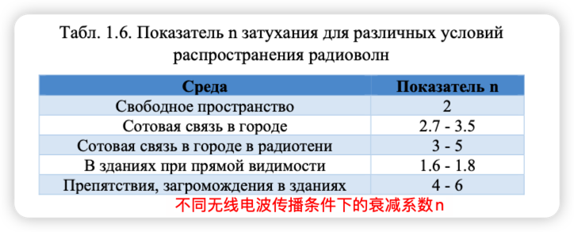
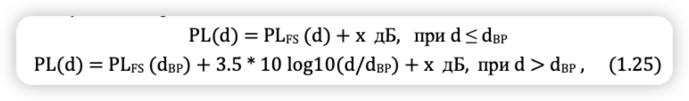

 

  
   
   
  <b><b>Санкт-Петербургский государственный политехнический университет</b> </b>
  <b>Институт компьютерных наук и технологий</b>
 

 

<!-- SPbSTU 最后一行 -->

**简介**

电信系统模型被广泛用于新一代通信系统的设计，如蜂窝网络、无线局域网和个人网络。仿真使开发开放系统交互参考模型（OSI模型）各个层次的处理算法成为可能，而不需要实施现场实验的巨大成本。

> OSI模型（开放式系统互联模型）：
>
> - **第7层 应用层**
>
>     应用层（Application Layer）提供为应用软件而设计的接口，以设置与另一应用软件之间的通信。例如：HTTP、HTTPS、FTP、Telnet、SSH、SMTP、POP3等。
>
>     
>
> - **第6层 表现层**
>
>     表现层（Presentation Layer）把数据转换为能与接收者的系统格式兼容并适合传输的格式。
>
>     
>
> - **第5层 会议层**
>
>     会议层（Session Layer）负责在数据传输中设置和维护计算机网络中两台计算机之间的通信连接。
>
>     
>
> - **第4层 传输层**
>
>     传输层（Transport Layer）把传输表头（TH）加至资料以形成分组。传输表头包含了所使用的协议等发送信息。例如:传输控制协议（TCP）等。
>
>     
>
> - **第3层 网络层**
>
>     网络层（Network Layer）决定数据的路径选择和转寄，将网络表头（NH）加至数据包，以形成分组。网络表头包含了网络资料。例如:互联网协议（IP）等
>
>     
>
> - **第2层 数据链路层**
>
>     数据链路层（Data Link Layer）负责网络寻址、错误侦测和改错。当表头和表尾被加至数据包时，会形成[信息框](https://zh.wikipedia.org/wiki/資訊框)（Info Box）。数据链表头（DLH）是包含了物理地址和错误侦测及改错的方法。数据链表尾（DLT）是一串指示数据包末端的字符串。例如以太网、无线局域网（Wi-Fi）和通用分组无线服务（GPRS）等。
>
>     分为两个子层：逻辑链路控制（logical link control，LLC）子层和介质访问控制（Media access control，MAC）子层。
>
>     
>
> - **第1层 物理层**
>
>     物理层（Physical Layer）在局域网上发送[数据帧](https://zh.wikipedia.org/wiki/数据帧)（Data Frame），它负责管理电脑通信设备和网络媒体之间的互通。包括了针脚、电压、线缆规范、集线器、中继器、网卡、主机接口卡等
>
> 

下图显示了一个电信系统的功能图，它包含了与OSI模型的**两个低层：物理层和数据链路层**有关的元素。

发射器和接收器执行物理层任务，将发射器输入的比特序列转换为在通信线路上传输的信号，并在接收器中处理信号，对传输的比特序列作出决定。由于通信线路中的噪声和信号失真影响，收到的数据含有错误。为了提高传输的可靠性，采用了无噪声编码：编码器在传输的数据中加入校验码，在解码器中用于检测和纠正错误。

图中所示的物理层和数据链路层元素存在于所有电信系统中，并在本教程中讨论。

为了简化建模，一个复杂的系统模型可以分为两部分：

1. 物理层模型，包含发射器、链路模型和接收器；
2. 数据链路模型，包含编码器、离散通道模型和解码器。

物理层电信系统模型中的通信链路模型是由有线或无线链路的属性定义的。在数据链路层系统模型中，物理层的实现被一个离散的信道模型所取代，该模型由发生在接收器输出端的错误流所指定。

应该注意的是，这种方法有一个局限性，即它不能适用于复杂的信号编码设计，即信号生成和编码一起使用的情况。

手册的第一部分专门介绍无线电通信线路的模型。考虑了蜂窝网络和无线局域网（WiFi）中的线路模型，它可以**计算出线路中的信号衰减和接收地点的预期信号强度**。它描述了一个用于安卓智能手机的应用程序，可以测量2G、3G、4G和WiFi蜂窝网络的信号强度，以及测量数据传输速度和延迟。

手册的第二部分介绍了**MATLAB/Simulink仿真环境中的物理层模型**。**该模型允许构建错误概率对所选调制方法和具有加性白高斯噪声的通信链路的信噪比的依赖性。**

**第三部分介绍了两个数据链路层模型。第一个模型在MATLAB/Simulink仿真环境中实现，使用错误检测模式的块状循环码。这个模型决定了为达到不超过阈值水平的错误接收概率（遗漏数据块中的错误）所需的检查字符数量**。**第二个模型涉及一个在纠错模式下运行的解码器。该模型可以估计两种离散信道模型的纠错效率：具有独立错误的二进制对称信道和希尔伯特错误包装模型**。

每一节都包含供学生独立工作的任务。

# 无线电线路模型

## 无线电线的特性

国际协议将用于无线电通信的整个无线电波频谱分为以下几个波段。

大多数现代无线通信系统使用高频段（УВЧ, СВЧ, КВЧ）。这一选择是由以下原因决定的。

- 天线的几何尺寸必须符合 将要发射的电磁波的波长。

- 信息的高速传输和大量通信线路的组织需要一个宽广的带宽 高速传输和组织**大量的链接需要很大的带宽，而这种带宽只有在高频段**才有。

无线电波在高频段的传播主要受三种物理现象的影响：**反射（отражение）、衍射（дифракция）和散射（рассеяние）**（见图1.1）。当电磁波的传播被一个明显大于波长的物体所阻碍时，就会发生反射，例如地面和建筑物的表面。

**衍射**是当无线电波碰到有尖锐边缘的障碍物时产生的二次波现象。衍射是由于在几何阴影区的障碍物后面存在一个场而引起的。**当波在有小物体（小于波长）的介质中传播时，会发生衍射** (меньше длины волны)。

当接收器相对于发射器移动时，发生**多普勒效应**，导致无线电信号的频移。这些现象的综合影响导致接收器输入端的信号功率变化（信号衰减），也导致符号间干扰的出现，表现为信号失真。为了消除由线路噪声、衰减和失真引起的数据损失，**现代无线电系统使用复杂的算法来适应不断变化的信号传播条件，以及允许检测和纠正接收的比特序列中的错误的噪声纠正编码算法。应该注意的是，无线电通信系统的自适应行为会导致传输速率的变化。例如，当手机靠近基站时，可以达到最大的传输速率（在自由网络条件下）。随着距离的增加，接收器输入端的信号功率急剧下降（在自由空间中，衰减与距离的平方成正比），无线电系统转而使用更白、更节能的信号，数据速率更低。**

每个无线电通信运营商都必须拥有许可证，以及国家无线电频率委员会的许可，才能使用某个无线电频段。例外情况是所有用户都可以使用的非授权ISM（工业、科学和医疗）频段，但必须使用经认证的有限范围的通信设备，一般不超过100米。

## 蜂窝通信网络（Сотовые сети связи）

移动通信以蜂窝网络为基础，该网络由分布式基站（固定蜂窝塔）组成，用户移动站（电话）与之连接，其中还包含交换节点。无线电覆盖区被划分为若干区域--小区--其中的用户被连接到一个特定的基站。当用户的移动设备从一个小区移动到另一个小区时，它就会切换到另一个基站，从而在移动终端和基站之间保持永久的无线电联系，使用符合特定通信标准的协议（GSM、UMTS、LTE）。

在创建新一代通信时，主要要求是提高信息传输速度和网络容量（与大量活跃的移动设备同时工作的能力），以及减少网络延迟。五代系统被创造出来，其主要特征见下表。

第五代5G蜂窝通信系统旨在大幅改善过去几代的参数，并支持快速发展的新技术，如物联网。第五代网络的主要特点。

- 改善宽带连接--提高传输速度并支持许多无线技术。
- 高可靠性--减少丢包的数量，将延迟减少到1ms，支持用户高速移动。
- 支持物联网设备--设备密度高（每平方公里高达100万），计算复杂度低，功耗低。

在移动蜂窝网络上传输信息的程序包括以下步骤。来自移动用户设备的信号通过无线射频链接到达基站。反过来，信号由基站的接收设备处理，从中提取数字信息，然后发送到交换中心。基站和交换中心之间的信息传输可以通过无线电中继（通过无线中继器网络）或通过光纤或电缆系统进行。

传输过程的第一步是让你的手机检查它在你所呼叫的地区是否有覆盖。一旦手机确认有足够的信号强度来进行通话，手机就会与最近的基站建立连接。然后这个基站建立呼叫，并保持呼叫，只要电话用户继续呼叫并在这个基站的范围内。

移动电话基站为一个地理区域提供无线电覆盖，称为小区或单元。

细胞以蜂窝状的方式彼此相邻排列，正是由于这个原因，这种网络是 "蜂窝状 "网络（见图1.2）。

基站在小区中的位置是由一些因素决定的，包括地形、树木和建筑物的存在、预计在小区中进行的呼叫数量以及基站将运行的无线电频率。移动电话需要 "看到 "基站。山丘、树木和高大的建筑物会掩盖这一视线。每个基站只能传输有限的呼叫。在移动电话使用率高的地区，如中央商务区和人口密度高的地区，需要更多的基站来处理呼叫流量。使用率高的地区往往有许多基站，包括特定的解决方案，如室内站（在建筑物或地铁区域内提供高质量的覆盖）。

在农村地区或移动电话使用较少的地区，基站通常会设在山上或高楼或塔楼上，以最大限度地扩大覆盖范围。

**每个基站都有一些无线电频道或频率来与移动电话通信。由于频率的数量有限，这些频率经常在不同的单元中被重复使用。这导致限制了基站的功率水平，以确保使用相同频率的小区之间的重叠度最小。**

随着移动电话的移动，呼叫从一个基站转换到另一个基站。当用户离开小区时，手机会自动搜索邻近基站的信号。通常情况下，当你从一个小区移动到另一个小区时，会话是无缝切换的。如果没有相邻的基站，例如在移动电话网络的外围，呼叫将被终止。

基站发射器的功率范围为：小型小区250 mW（24 dBm），最大的5G MIMO阵列120 W（50 dBm）。一个典型的2G、3G或4G基站的发射功率为20W（43dBm）。

图1.3 显示了一个典型的包含3根天线的基站塔的设计。每根天线用于在120度的水平区域内发射信号。**天线外壳内有12个垂直辐射元件（偶极），呈2×6排列。==天线的增益是聚焦辐射的结果==**：图中天线的增益为15dB。这意味着在主要传输方向（天线孔径）的辐射功率是各向同性辐射天线的32倍，后者在所有方向上的辐射功率相同。

基地台和移动台使用一个特定的频段（Band），利用无线电信号传输信息。每个频段都有一套功能：上行频段（Uplink从基站到用户设备），下行频段（Downlink从用户设备到基站），双工模式（дуплексной связи）。**频分双工（FDD）模式，即在不同的频率上进行接收和传输**，**时分双工（TDD）模式，即在同一频率上交替进行接收和传输，用于确保双工通信**。为满足移动运营商的需求而分配频段是在国家层面上进行的，通常考虑到现有的特殊、军事和民用通信基础设施的特殊性。

频段编号被引入以描述3G和4G（LTE）标准。对于GSM来说，可以应用相应的3G/4G频段号（Band 3或Band 8）。

## 无线电链路中的信号衰减模式

从系统设计到性能评估，无线通信的几乎所有方面都取决于对无线电信号通过无线电链路传播时的特性的理解。文献中有两种类型的无线电信道模型：**用于计算无线电信号衰减的模型，即作为距离函数的信号功率损失**，以及**可以从中产生无线电链路的脉冲响应并计算接收器输入端的波形的模型**。**第一种类型的模型允许我们确定发射器的服务区域**。本节将讨论这些模型。**第二种类型的模型被用来创建物理电信系统的模型，并开发无线电信号生成和接收的算法**。

无线电传播模型的基础是预测离发射器一定距离的平均接收信号水平，并根据跟踪的具体情况确定信号水平的扩散。作为发射器和接收器之间距离的函数，平均信号水平的建模决定了大规模的依赖性，因为它使确定远距离（达数千米）的信号成为可能。此外，模型可以描述在小的偏移量（几个波长）或短时间内（几秒钟）快速变化的接收信号电平值--这些被称为小尺度依赖性（见图1.4）。

作为发射器和接收器之间距离的函数，信号强度的计算决定了电信系统的范围：接收器输入端的信号强度必须至少与接收器的灵敏度一样高--提供所需的抗干扰性的最小功率。由于小范围的依赖性通常是由随机变量给出的，接收器在有把握的接收区域的位置只能以概率p确定，这取决于模型参数。

### 自由空间传播模型

自由空间传播模型用于计算发射和接收天线位于开放、无遮挡的无线电线路上的条件下的接收信号。这个模型被用来分析通过卫星的无线电链路和在UHF频段工作的地面无线电链路。当信号在自由空间传播时，**接收器输入Pr的信号功率由公式计算**。
$$
P_r=\frac{P_t \cdot G_t \cdot G_r \cdot \lambda^2}{(4 \pi)^2 \cdot d^2}
$$
其中Pt是发射器输出的信号功率，W。
Gt和Gr--发射和接收天线的增益；--无线电信号的波长，m。
d - 发射器和接收器之间的距离，米。天线增益的确定方法如下
$$
G=\frac{4 \pi \cdot A_э}{\lambda^2},
$$
其中Ae为天线的有效表面积，m2。

**波长与载波的频率f**的关系为
$$
\lambda=\frac{c}{f}
$$
其中光速为c = 299,792,458 m/s。术语载波被定义为正弦无线电信号，其中关于要传输的数据的信息被嵌入到振幅、频率或相位的变化中。

根据（1.1），**天线接收的信号功率与距离d的平方成正比下降**。PL无线电信道中的信号衰减，等于发射器输出端的信号与接收器输入端的信号功率在对数尺度上的比率（dB），定义为
$$
\mathrm{PL}(\mathrm{d})=10 \cdot \lg \frac{P_t}{P_r}=-10 \cdot \lg \left[\frac{G_t \cdot G_r \cdot \lambda^2}{(4 \pi)^2 \cdot d^2}\right] \text {, дБ }
$$
相对于各向同性天线的G=1增益，天线增益通常以分贝（对数尺度）给出，该天线在空间的所有方向上辐射相同的功率。那么表达式（4）可以写成：
$$
\operatorname{PL}(\mathrm{d})=-20 \cdot \lg \left[\frac{\lambda}{4 \pi d}\right]-G_t\left(\text { дБ) }-G_r\right. \text { (дБ) }
$$
接收器输入端的信号功率，与测量水平1 mW相关的对数刻度（记录为dBm）
$$
P_r=P_t-\mathrm{PL}(d) \text { дБм }
$$
其中发射器输出Pt处的信号功率以dBm为单位。
前面的表达方式只对远区（或弗劳恩霍夫区）有效。远区边界是由条件定义的
$$
d_f=\frac{2 D^2}{\lambda}
$$
其中D是最大的天线尺寸。
一个额外的远场条件必须是满足比率的要求。
$$
\begin{aligned}
&d_f>>D \\
&d_f>>\lambda
\end{aligned}
$$
在远距离，当计算接收点的信号强度时，可以将信号传播路径分为2个部分：对于0-d0部分，可以使用自由空间的信号强度计算，对于第二部分d0-d，可以使用下面几节给出的模型

### 对数距离损失模型

理论和实验研究表明，接收到的功率根据距离的不同，按照对数规律变化。这一规律在建筑物外和建筑物内的无线电线路上都得到了满足。在对数距离路径损失模型中，任意距离上的平均大规模损失（信号衰减）由表达式描述。

其中n是一个功率因子，它显示了信号功率损失随距离增加的速度。
d0是发射器到第一个跟踪段边界的距离，d是发射器和接收器之间的距离。
(8)中的破折号是指给定距离d的可能损失值的平均值。
对于一个给定的距离d。n的值取决于传播介质的具体参数。

在覆盖面积较大的蜂窝通信中，通常使用1公里的距离作为d0值，在微蜂窝系统中为100米，在皮蜂窝系统中为10米。这个距离应对应于天线的远场，以避免近场效应。在距离d0处的信号衰减是用自由空间传播公式（4）计算出来的，或者由在这个距离上测量的信号强度给出

### 对数-正态模型

公式（1.8）没有考虑到介质参数在两次测量之间可能迅速变化的事实。接收器输入端的信号功率的随机性在对数正态阴影模型中得到了考虑。测量表明，无线电信道中的功率衰减是由对数正态规律描述的（随机变量的对数具有正态分布）

其中，Xσ是一个具有正态分布规律的随机变量，均值为零，标准差为σ dB。

这些公式可用于计算实际通信系统中存在随机信号衰减因素时的场。在实践中，n和σ的值通常由实验研究确定。

### 2G蜂窝系统的信号衰减模型

基于实验数据的Hata-Okumura模型[1]可用于计算城市环境中900MHz（8号频段）频率的信号衰减。

其中fc为信号频率，单位为MHz 150至1500MHz。
hte - 基地天线的有效高度，以米为单位（30至200米）， hre - 移动天线的有效高度，以米为单位（1至200米）。
10 м),
d发射器到接收器的距离，公里（1到20公里），a(hre)是移动天线有效高度的修正系数，它是一个函数。
是移动天线有效高度的修正系数，它是服务区的一个函数。

适用于中小型住区

对于大型城市

对于郊区，基本公式（10）修改如下

对于开放的地形，会有信号衰减

对于1800兆赫（频段3）的频率，欧洲协会EURO-COST（欧洲科技合作）提出了一个新版本的COST-Hata-Model，真正适用于2GHz以下的频率。城市环境中的信号衰减的计算公式写成如下[2]

其中a(hre)由公式(11)定义。
对于中等规模的城市和具有中等树木密度的郊区，Cm=0dB。
大城市的Cm=3dB。(15)中允许的参数限制。
fc : 1500...2000 MHz, hte : 30...200 m,
hre : 1...10 m,
d : 1...20公里。

当基站天线的高度高于相邻屋顶的水平时，COST-Hata模型的应用仅限于大型和小型宏基站（见表1.7）。这些公式不能用于微电池

### 3G蜂窝系统的信号衰减模型

国际电信联盟的模型，ITU建议M.1225[3]，被用来评估3G蜂窝网络的信号衰减。该建议定义了3种类型的测试环境

- 室内办公室测试环境（室内办公室测试环境），这种环境的特点是尺寸小，传输功率低。基站和用户设备都位于室内。由于在墙壁、地板和金属结构（如隔板和机柜）上的散射和衰减，信号的衰减也有所不同。这些物体也会产生阴影效果。衰减的对数正态标准差可望达到12dB。
- 从室外基站到室内或行人的信号传输的室外到室内和行人的测试环境。室外可接受标准偏差为10分贝的对数正态衰减法，室内可接受12分贝。建筑物的渗透损失平均为12dB，标准偏差为8dB
- 车辆测试环境

一个**室内痕量损失模型**（以对数为单位，dB）以下列简化形式提出，它是由室内COST模型衍生出来的

其中。
d是发射器和接收器之间的距离（米），

n是轨道上的楼层数。

对于（1.16）中的损失值，必须添加一个随机变量，它具有正态分布规律，标准偏差为12dB。

**行人环境的损失模型**：

d--基站(BTS)到移动站(MS)的距离，公里。
f是信号频率，单位为MHz（不能偏离2GHz）

这个模型只对从基站到移动站的无视线（NLOS）情况有效，并描述了最坏情况下的衰减。对于（1.17）中的损失值，必须添加一个随机变量，该变量具有正态分布规律，行人的标准偏差为10分贝，室内用户的标准偏差为12分贝

**车辆的损失模型**：

d - 基站到用户终端的距离，以公里为单位，

fc - 信号频率，以MHz为单位（不得偏离2GHz），

hte - 基站天线的高度，以米为单位，从平均屋顶高度测量，覆盖屋顶（一般建议为15米）。
车辆模型假设了一个最坏情况下的路径
城市和郊区的NLOS和对数正态衰减，标准偏差为10dB。

###  4G蜂窝系统的信号衰减模型

由于使用具有空间信道分割的MIMO（多输入多输出）传输方法以及天线波束成形技术，4G系统评估方法中使用了三维信道模型[4, 5]

图1.5显示了从基站到行人和室内用户终端的三维距离的定义

典型的4G使用场景是城市宏蜂窝（3D-UMa）和微蜂窝（3D-UMi），基站位于室外。在宏基站中，基站位于周围建筑物的上方，在微基站中，基站位于下方。对于每个场景，都考虑了2种情况：基站和用户终端之间的视线（LOS）和无视线（NLOS）

一个3D-UMi LOS微单元的信号衰减为

其中距离d3D以米为单位，信号频率fc以GHz为单位。公式（1.20）在10 m < d2D < d'BP条件下有效，其中
断点距离d'BP=4 h'BS h'UT fc/c，其中fc为信号频率，单位为Hz，c=3.0108 m/s为传播速度。
在自由空间，h'BS和h'UT是基站（BS）和用户终端（UT）天线的有效高度。在3D- UMi方案中，有效天线高度h'BS和h'UT计算如下：h'BS=hBS-1.0米，h'UT=hUT-1.0米，其中hBS和hUT是实际天线高度（有效环绕高度1.0米）。hBS的典型值=10米，用户的终端可能在1.5米≤hUT≤22.5米的范围内的高度。如果距离d2D在d'BP < d2D < 5000 m的范围内，那么信号衰减就按照公式计算。

其中d3D距离以米为单位，信号频率fc以GHz为单位。
在NLOS情况下，3D-UMi微电池的信号衰减形式为：

其中距离d3D以米为单位，信号频率fc以GHz为单位。公式（1.22）在10米< d2D < 2000米的条件下有效，典型的是
hBS的值=10米，1.5米≤hUT≤22.5米

为了考虑到信号的细微衰减，在损失值上加上
在（20-22）中，必须添加一个随机变量，它具有正态分布规律，LOS的标准偏差为3dB，NLOS的标准偏差为4dB

3D-UMa宏观和LOS情况下的信号衰减与3D-UMi-LOS在公式（1.20）和（1.21）中确定的相同

对于无视线情况下的信号衰减计算
在3D-UMa中考虑到了城市环境的特点

其中距离d3D以米为单位，信号频率fc以GHz为单位。
h是建筑物的平均高度，范围为5米<h<50米，典型值h=20米。
W为街道宽度，范围为5米<W<50米，典型值W为20米。
典型值hBS = 25mi10m < hBS < 150m, 1.5m ≤ hUT ≤ 22.5m。

公式（1.23）在10 m < d2D < 5,000 m的条件下有效。
为了说明小规模的信号衰减，必须在损失值中加入一个具有正态分布规律的随机变量，LOS的标准偏差为4dB，NLOS为6dB。
如果用户终端在室内，必须考虑到由于建筑物墙壁中的信号衰减而造成的额外损失。

公式（1.23）在10 m < d2D < 5,000 m的条件下有效。
为了说明小规模的信号衰减，必须在损失值中加入一个具有正态分布规律的随机变量，LOS的标准偏差为4dB，NLOS为6dB。
如果用户终端在室内，必须考虑到由于建筑物墙壁中的信号衰减而造成的额外损失。

其中城市环境中的信号衰减为
微观世界的PLb = PL3D-UMi (d3D-out + d3D-in) 或宏观世界的PLb = PL3D-UMa (d3D-out + d3D-in)。

墙内信号衰减PLtw=20dB。
室内信号衰减PLin=0.5d2D-in dB，0m<d2D-in<25m。
用户终端位置的高度可以用公式来估计。
hUT=3(nfl-1)+1.5米，其中nfl是建筑物的楼层编号，nfl=1，2，...，8。只要10m<d2D-out+d2D-in<1000m，公式（1.24）就有效。

### WiFi网络的信号衰减模型

下面的描述是基于IEEE802.11 TGn和TGac工作组开发的信道模型[6, 7]，用于模拟IEEE 802.11n和IEEE 802.11ac物理层，适合描述接收信号在典型室内环境中传播后的情况。

对于室内应用，在5-10米的近距离与较远距离的跟踪损失不同。对于较短的距离，自由空间的传播模式适用。在较远的距离上，来自周围墙壁和家具的反射通常会导致接收器输入端的信号功率出现更明显的衰减。信号的衰减可以用以下方式来模拟。

PL(d) = PLFS (dBP) + 3.5 * 10 log10(d/dBP) + x dB, for d > dBP , (1.25)
其中d是发射器和接收器之间的距离，单位为米。
PLFS（d）是自由空间的信号衰减（见公式（5））。
dBP是断点距离，这取决于房间类型（见表1.8）。
x是一个具有正态分布规律的随机变量，均值为零，标准差为σ（单位：dB）。
请注意，σ的值在突破点之前和之后是不同的，到这个点的距离通常被认为是视线（LOS）条件的边界。
该模型可用于2.4GHz和5GHz频段，因为模型的开发 . 两个频段的结果都被用于开发模型。

表1.8显示了对应于不同网络位置情况的6个模型的参数。

- 模型A：这是一个理想的模型，没有相应的现实世界的用例。相应的现实世界的使用场景，通常仅用于理论研究。
- 模型B：一个小规模的网络（家庭场景），位于 在一个房间里和房间之间。
- 模式C：中小型网络场景，通常是
  用于大型客厅或小型公共区域，如会议厅、教室等。
- 模式D：用于正常的办公场景，如办公楼的特定楼层、大会议室、有办公室的办公区等，这是一个典型的
  典型的商业场景。
- 模式E：购物中心的大规模办公网络：多层办公大楼和小型校园。
- 模型F：大规模的室内和室外网络在工业区、城市地区等。

## 蜂窝网络中的数据传输速度和延迟

用户对更高数据速度的需求是创建新一代蜂窝通信系统背后的主要驱动力之一。每一代蜂窝网络都能提供高达数倍的传输速度。然而，除了标准之外，每个网络的实际性能将取决于供应商、网络配置、特定小区的活跃用户数量、特定地点的无线电链路的属性、使用的设备以及许多其他因素。实际环境中的数据传输速度没有保证，典型的数据传输速度可能与理想条件下才能达到的估计最大速度有很大差异（超过一个数量级）（见表1.9）

任何网络的实际性能都有很大差异。智能手机应用程序必须适应网络内不断变化的条件：带宽、延迟，甚至无线电连接的可用性。当用户在移动时，他们的智能手机很可能会根据可用的覆盖范围和信号强度，在几代网络（LTE、HSPA+、HSPA、EV-DO，甚至GPRS Edge）之间切换。此外，必须考虑到用户手中的设备也必须能够利用已部署的无线电基础设施。运营商可能会部署最新的LTE基础设施，但为早期版本设计的设备可能根本无法利用它，反之亦然。为了从任何网络中获得最佳性能，设备必须满足每种网络类型的指定用户设备（UE）类别要求。例如，为了实现4G网络的高速度，UE设备必须包含4x或8x MIMO，以满足6以上的类别要求

移动设备的能力受到电池容量的限制，而且要求网络效率高，为一个小区的大量活跃用户服务。在实践中，必须在保持用户终端无线电活动以低延迟服务于交互式流量和循环到低功率模式以确保可接受的电池寿命之间取得平衡。无线电资源控制器（RRC）完全负责调度谁在什么时候发言、分配的带宽、使用的信号功率和其他十几个变量。RRC是由网络管理的。在4G中，RRC逻辑的实现已经直接转移到服务基站（eNodeB），以提高性能和减少协调延迟

用户设备可能处于空闲状态，在这种情况下，它只监听控制信道的广播信息，如传呼通知的传入流量，或者处于连接状态，在这种情况下，设备要么在传输数据，要么在等待数据，网络已经为客户端建立了上下文和资源分配。在空闲状态下，设备不能发送或接收数据。要做到这一点，它必须首先通过监听网络广播与网络同步，然后向RRC发送一个请求，以移动到 "连接 "状态。设备和节点之间可能需要进行几次信息传输，以建立这种调和。LTE规范为这种状态转换分配的目标时间是100毫秒或更少。在LTE-Advanced中，该目标时间已进一步减少到50毫秒

假设用户已经对4G网络进行了认证，而且移动设备没有在使用。然后，用户输入URL并点击 "开始"。接下来会发生什么？首先，由于手机处于空闲状态，用户的无线电台必须与最近的基站同步，并发送请求建立一个新的无线电环境（图1.6，步骤1）。一旦建立了无线电环境，设备就会收到来自基站的资源分配，并能以指定的速度和信号强度进行发射（步骤2）。从用户无线电到塔台传输数据包的时间被称为 "单向用户级延迟"，对于4G网络来说，最多需要5毫秒。因此，由于需要进行RRC状态转换，第一个数据包会有更长的延迟，但紧随其后的数据包只有单向延迟。接下来，数据包必须通过核心网络--通过SGW服务网关到PGW数据包网关（第3步），然后输出到公共互联网（第4步）。核心网络还包含一个移动性管理对象（MME）和一个政策和计费规则功能（PCRF）。不幸的是，4G标准并不保证这一路径的延迟，因此这一延迟将因运营商而异。表1.10中给出了典型的延迟值。 还应考虑运营商的分组网关和公共互联网上的目标地址之间的可变延迟。

数据包在每个阶段都由PGW、SGW和基站（eNodeB）缓冲，直到它们可以被路由到设备。在实践中，这导致了数据包到达时间的明显抖动，由于管理层的协商，第一个数据包受到的延迟最长。

## **Программа Network Cell Info**

### 方案的主要特点

该程序是获取蜂窝网络信号信息的通用工具（仅适用于Android设备）。网络细胞信息精简版可在Google Play商店购买。
Network Cell Info是一个监测和测量蜂窝网络覆盖的工具。(4g+, lte, cdma, wcdma, gsm)。还提供了Wi-Fi覆盖范围的统计数据。

主要特点。
- 对蜂窝和Wi-Fi信号进行近乎实时的监测（1秒内）。
- 支持GSM、CDMA、UMTS（WCDMA）、IWLAN、LTE、LTE+ - 支持两张SIM卡。
- 蜂窝电话和WiFi的信号强度计。
- 基站位置的视觉表现在
  使用Mozilla定位服务（MLS）在地图上直观地展示基站位置。
- 基于信号强度的动态路线着色，包括地图上带有位置和信号信息的标记。
- 记录和测量蜂窝信号。
- 测量设置（最小距离、最小精度、运动传感器等）。
- 以KML 2.2、MLS Geosubmit v.2、CLF v.3、OpenCellID csv、CMWF格式将测量结果导出到数据库中

### 快速启动指南

**仪表盘标签**
这是最初的标签，显示主要的网络信号强度和服务小区以及邻近小区的信息。顶部的指示器 "服务小区 "显示您当前所连接的基站的信号强度。其他 "邻居#x "仪表是邻近小区的信号水平，如果你移动或网络决定，你可能会切换到这些小区。此外，这个标签提供了关于WiFi和双卡手机（安卓5+）的第二张SIM卡的信息（如果在应用设置中启用）。在图中，黄色数字表示。

1. 关闭应用程序，应用程序设置和反馈的溢出按钮，等等。
2. 可用的标签（功能）。
3. 信号强度、无线网络类型和网络供应商名称。
4. SDR：服务状态、移动数据和漫游开/关指示
5. 信号强度和质量传感器。
6. 服务单元的识别细节。
7. 相邻的蜂巢式传感器，范围信息。
8. 点选一个单独的传感器来禁用它（处理器加速）。
9. WiFi信号信息

请注意。如果任何字段显示"-"或空白，这意味着设备/安卓系统没有提供这些信息

你可以在应用程序设置/关于应用程序/常见问题中找到所有缩写。
对于有两张SIM卡的智能手机，标签如下

1.SIM1细胞信息
2.SIM2手机信息（适用于有两张SIM卡且Android版本>5的手机）。
3.Wi-Fi网络信息
4. 频段信息（仅适用于安卓7）

请注意。你可以点击任何指标来禁用它以节省CPU资源

**原始标签(Raw)**

原始选项卡提供了关于无线连接的详细信息。

1. “数据：”显示使用的是移动数据还是 WiFi 数据。
2. 此行显示当前连接信息/状态 [提示：您可以“单击”此行以获得更抽象的视图]
3. 此行显示服务小区连接状态。
4. 这行和随后的行显示了相邻小区的状态。

注意： 如果某些字段显示“-”或为空，则表示设备/Android 不提供该信息。

**Вкладка график** (**Plot)**

此选项卡显示了服务小区和相邻小区的信号强度随时间的演变，允许更好地探索网络质量，尤其是在移动时。

1. Y 轴：以 dBm 为单位的信号强度
2. 绘制服务 (S) 和相邻 (N#) 单元格的图例（颜色）
3. 随时间变化的信号强度图
4. 无线网络类型和网络提供商名称
5. 服务小区详情
6. 按顺序排列的相邻小区详细信息

**Вкладка График 2 (Plot 2)**

此选项卡绘制随时间变化的信号强度/质量，它更适合 LTE 无线系统。

1. 无线网络类型，服务小区详情
2. LTE RSSNR 随时间变化
3. LTE RSRP 随时间变化
4. LTE RSRQ 随时间变化
5. 时间和情节传说

 

注意：您可以单击图形中的一个点，它将显示 Y 轴值

**Вкладка Статистика (Stats)**

此选项卡提供有关网络稳健性和覆盖范围的基本信息。例如，您可能有 4G 计划，但网络大部分时间将您连接到 2G 或 3G 无线网络。

1. 当蜂窝数据打开或关闭时，每个 2G、2.5G、3G、3.5G、4G 或 4G+ 技术的连接统计信息，以及计数的样本数。
2. 条状图
3. 重置按钮以重置统计计数器
4. 用于控制条形图的复选框

**Вкладка Карта (Map)**

此选项卡是完成测量的地方，并提供视觉位置和单元信息。

1. 应用关闭、应用设置、反馈溢出按钮等。
2. 无线网络类型和网络提供商名称
3. 服务细胞计量器连同细胞信息
4. 邻居 #1 单元格仪表以及单元格信息
5. 当前位置 Lat、Lon，位置精度以 m/ft 为单位
6. 测量次数和单元位置，以及距离和精度设置
7. 以 km/h 或 mph 为单位的速度（来自设置）
8. 当前位置
9. 服务小区位置不是塔位置（标记有相关信息）

笔记！我们不显示塔位置，而是来自 Mozilla MLS 数据库的单元位置指示。我们没有塔数据库。

 

a) 进行的测量（标记也有相关信息，连接线根据信号电平）

b) 清除测量标记和线条

c) 完全清除地图

d) 保存日志文件（将数据库保存到设备存储中）

e) 开始/暂停更新

f) 锁定（解锁）光标在中心

g) 打开最佳信号查找器层

h) 放大

i) 缩小

j) 中心位置图

k) 位置标记

**Вкладка УСТРОЙСТВО+SIM**

此选项卡提供有关 SIM 卡和设备的信息。

1. 设备电话相关信息
2. API17 单元功能：拥有应用程序的全部功能应该是“是”。不幸的是，并非所有 API17+ 设备都实现 API17 电话功能，但有些设备只实现 API1 功能！
    例如，未实现 API17 电话功能的设备不会显示 LTE 的邻居或 PCI。此外，未实现 API17 电话功能的 Android 7 设备也不会显示 LTE 频段。
3. 设备相关信息

**Вкладка Скорость** (**Speedtest)**

Speedtest 选项卡目前处于 Beta 版，提供了一个选项来测试您的连接速度。

1. 下载速度显示您的设备从服务器提取数据的速度（以每秒兆比特 - Mb/s 为单位）。
2. 上传速度显示您的设备发送数据的速度（以每秒兆比特 - Mb/s 为单位）。
3. 数字显示速度测试期间的可变下载速度。
4. Ping 测量您的连接的反应时间。该数字以毫秒为单位，显示您在发送请求后获得响应的速度。这通常被称为延迟。
5. 抖动测量 ping 随时间的变化。
6. 仪表在速度测试期间显示可变的下载和上传速度。
7. 按下启动按钮启动速度测试。
8. Speedtest Dashboard 显示上次测试的日期和时间、连接类型和测试结果。

## **Самостоятельная работа**

### Подготовка к работе

1) 安装Network Cell Info Lite软件
2) 研究用户手册

### 开展工作的程序

使用Network Cell Info Lite，根据第1至4点对每个2G、3G、4G和WiFi网络模式进行以下测量。你可以在手机设置中切换网络模式，例如：设置/SIM和移动网络/SIM卡（选择哪种模式）/首选网络类型/仅2G或首选3G或首选4G。你也可以通过网络单元信息精简版菜单改变模式：设置/常规/系统网络设置

==小米：设置->搜索->网络类型选择==

