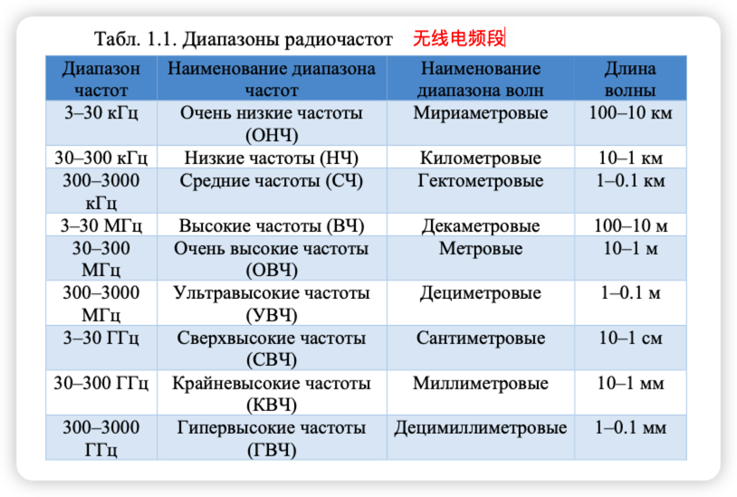

 

  
   
   
  <b><b>Санкт-Петербургский государственный политехнический университет</b> </b>
  <b>Институт компьютерных наук и технологий</b>
 

 

<!-- SPbSTU 最后一行 -->

**简介**

电信系统模型被广泛用于新一代通信系统的设计，如蜂窝网络、无线局域网和个人网络。仿真使开发开放系统交互参考模型（OSI模型）各个层次的处理算法成为可能，而不需要实施现场实验的巨大成本。

> OSI模型（开放式系统互联模型）：
>
> - **第7层 应用层**
>
>     应用层（Application Layer）提供为应用软件而设计的接口，以设置与另一应用软件之间的通信。例如：HTTP、HTTPS、FTP、Telnet、SSH、SMTP、POP3等。
>
>     
>
> - **第6层 表现层**
>
>     表现层（Presentation Layer）把数据转换为能与接收者的系统格式兼容并适合传输的格式。
>
>     
>
> - **第5层 会议层**
>
>     会议层（Session Layer）负责在数据传输中设置和维护计算机网络中两台计算机之间的通信连接。
>
>     
>
> - **第4层 传输层**
>
>     传输层（Transport Layer）把传输表头（TH）加至资料以形成分组。传输表头包含了所使用的协议等发送信息。例如:传输控制协议（TCP）等。
>
>     
>
> - **第3层 网络层**
>
>     网络层（Network Layer）决定数据的路径选择和转寄，将网络表头（NH）加至数据包，以形成分组。网络表头包含了网络资料。例如:互联网协议（IP）等
>
>     
>
> - **第2层 数据链路层**
>
>     数据链路层（Data Link Layer）负责网络寻址、错误侦测和改错。当表头和表尾被加至数据包时，会形成[信息框](https://zh.wikipedia.org/wiki/資訊框)（Info Box）。数据链表头（DLH）是包含了物理地址和错误侦测及改错的方法。数据链表尾（DLT）是一串指示数据包末端的字符串。例如以太网、无线局域网（Wi-Fi）和通用分组无线服务（GPRS）等。
>
>     分为两个子层：逻辑链路控制（logical link control，LLC）子层和介质访问控制（Media access control，MAC）子层。
>
>     
>
> - **第1层 物理层**
>
>     物理层（Physical Layer）在局域网上发送[数据帧](https://zh.wikipedia.org/wiki/数据帧)（Data Frame），它负责管理电脑通信设备和网络媒体之间的互通。包括了针脚、电压、线缆规范、集线器、中继器、网卡、主机接口卡等
>
> 

下图显示了一个电信系统的功能图，它包含了与OSI模型的**两个低层：物理层和数据链路层**有关的元素。

发射器和接收器执行物理层任务，将发射器输入的比特序列转换为在通信线路上传输的信号，并在接收器中处理信号，对传输的比特序列作出决定。由于通信线路中的噪声和信号失真影响，收到的数据含有错误。为了提高传输的可靠性，采用了无噪声编码：编码器在传输的数据中加入校验码，在解码器中用于检测和纠正错误。

图中所示的物理层和数据链路层元素存在于所有电信系统中，并在本教程中讨论。

为了简化建模，一个复杂的系统模型可以分为两部分：

1. 物理层模型，包含发射器、链路模型和接收器；
2. 数据链路模型，包含编码器、离散通道模型和解码器。

物理层电信系统模型中的通信链路模型是由有线或无线链路的属性定义的。在数据链路层系统模型中，物理层的实现被一个离散的信道模型所取代，该模型由发生在接收器输出端的错误流所指定。

应该注意的是，这种方法有一个局限性，即它不能适用于复杂的信号编码设计，即信号生成和编码一起使用的情况。

手册的第一部分专门介绍无线电通信线路的模型。考虑了蜂窝网络和无线局域网（WiFi）中的线路模型，它可以**计算出线路中的信号衰减和接收地点的预期信号强度**。它描述了一个用于安卓智能手机的应用程序，可以测量2G、3G、4G和WiFi蜂窝网络的信号强度，以及测量数据传输速度和延迟。

手册的第二部分介绍了**MATLAB/Simulink仿真环境中的物理层模型**。**该模型允许构建错误概率对所选调制方法和具有加性白高斯噪声的通信链路的信噪比的依赖性。**

**第三部分介绍了两个数据链路层模型。第一个模型在MATLAB/Simulink仿真环境中实现，使用错误检测模式的块状循环码。这个模型决定了为达到不超过阈值水平的错误接收概率（遗漏数据块中的错误）所需的检查字符数量**。**第二个模型涉及一个在纠错模式下运行的解码器。该模型可以估计两种离散信道模型的纠错效率：具有独立错误的二进制对称信道和希尔伯特错误包装模型**。

每一节都包含供学生独立工作的任务。

# 无线电线路模型

## 无线电线的特性

国际协议将用于无线电通信的整个无线电波频谱分为以下几个波段。

大多数现代无线通信系统使用高频段（УВЧ, СВЧ, КВЧ）。这一选择是由以下原因决定的。

- 天线的几何尺寸必须符合 将要发射的电磁波的波长。

- 信息的高速传输和大量通信线路的组织需要一个宽广的带宽 高速传输和组织**大量的链接需要很大的带宽，而这种带宽只有在高频段**才有。

无线电波在高频段的传播主要受三种物理现象的影响：**反射（отражение）、衍射（дифракция）和散射（рассеяние）**（见图1.1）。当电磁波的传播被一个明显大于波长的物体所阻碍时，就会发生反射，例如地面和建筑物的表面。

**衍射**是当无线电波碰到有尖锐边缘的障碍物时产生的二次波现象。衍射是由于在几何阴影区的障碍物后面存在一个场而引起的。**当波在有小物体（小于波长）的介质中传播时，会发生衍射** (меньше длины волны)。

当接收器相对于发射器移动时，发生**多普勒效应**，导致无线电信号的频移。这些现象的综合影响导致接收器输入端的信号功率变化（信号衰减），也导致符号间干扰的出现，表现为信号失真。为了消除由线路噪声、衰减和失真引起的数据损失，**现代无线电系统使用复杂的算法来适应不断变化的信号传播条件，以及允许检测和纠正接收的比特序列中的错误的噪声纠正编码算法。应该注意的是，无线电通信系统的自适应行为会导致传输速率的变化。例如，当手机靠近基站时，可以达到最大的传输速率（在自由网络条件下）。随着距离的增加，接收器输入端的信号功率急剧下降（在自由空间中，衰减与距离的平方成正比），无线电系统转而使用更白、更节能的信号，数据速率更低。**

每个无线电通信运营商都必须拥有许可证，以及国家无线电频率委员会的许可，才能使用某个无线电频段。例外情况是所有用户都可以使用的非授权ISM（工业、科学和医疗）频段，但必须使用经认证的有限范围的通信设备，一般不超过100米。

## 蜂窝通信网络（Сотовые сети связи）

移动通信以蜂窝网络为基础，该网络由分布式基站（固定蜂窝塔）组成，用户移动站（电话）与之连接，其中还包含交换节点。无线电覆盖区被划分为若干区域--小区--其中的用户被连接到一个特定的基站。当用户的移动设备从一个小区移动到另一个小区时，它就会切换到另一个基站，从而在移动终端和基站之间保持永久的无线电联系，使用符合特定通信标准的协议（GSM、UMTS、LTE）。

在创建新一代通信时，主要要求是提高信息传输速度和网络容量（与大量活跃的移动设备同时工作的能力），以及减少网络延迟。五代系统被创造出来，其主要特征见下表。

第五代5G蜂窝通信系统旨在大幅改善过去几代的参数，并支持快速发展的新技术，如物联网。第五代网络的主要特点。

- 改善宽带连接--提高传输速度并支持许多无线技术。
- 高可靠性--减少丢包的数量，将延迟减少到1ms，支持用户高速移动。
- 支持物联网设备--设备密度高（每平方公里高达100万），计算复杂度低，功耗低。

在移动蜂窝网络上传输信息的程序包括以下步骤。来自移动用户设备的信号通过无线射频链接到达基站。反过来，信号由基站的接收设备处理，从中提取数字信息，然后发送到交换中心。基站和交换中心之间的信息传输可以通过无线电中继（通过无线中继器网络）或通过光纤或电缆系统进行。

传输过程的第一步是让你的手机检查它在你所呼叫的地区是否有覆盖。一旦手机确认有足够的信号强度来进行通话，手机就会与最近的基站建立连接。然后这个基站建立呼叫，并保持呼叫，只要电话用户继续呼叫并在这个基站的范围内。

移动电话基站为一个地理区域提供无线电覆盖，称为小区或单元。

细胞以蜂窝状的方式彼此相邻排列，正是由于这个原因，这种网络是 "蜂窝状 "网络（见图1.2）。

基站在小区中的位置是由一些因素决定的，包括地形、树木和建筑物的存在、预计在小区中进行的呼叫数量以及基站将运行的无线电频率。移动电话需要 "看到 "基站。山丘、树木和高大的建筑物会掩盖这一视线。每个基站只能传输有限的呼叫。在移动电话使用率高的地区，如中央商务区和人口密度高的地区，需要更多的基站来处理呼叫流量。使用率高的地区往往有许多基站，包括特定的解决方案，如室内站（在建筑物或地铁区域内提供高质量的覆盖）。

在农村地区或移动电话使用较少的地区，基站通常会设在山上或高楼或塔楼上，以最大限度地扩大覆盖范围。

**每个基站都有一些无线电频道或频率来与移动电话通信。由于频率的数量有限，这些频率经常在不同的单元中被重复使用。这导致限制了基站的功率水平，以确保使用相同频率的小区之间的重叠度最小。**

随着移动电话的移动，呼叫从一个基站转换到另一个基站。当用户离开小区时，手机会自动搜索邻近基站的信号。通常情况下，当你从一个小区移动到另一个小区时，会话是无缝切换的。如果没有相邻的基站，例如在移动电话网络的外围，呼叫将被终止。

基站发射器的功率范围为：小型小区250 mW（24 dBm），最大的5G MIMO阵列120 W（50 dBm）。一个典型的2G、3G或4G基站的发射功率为20W（43dBm）。

图1.3 显示了一个典型的包含3根天线的基站塔的设计。每根天线用于在120度的水平区域内发射信号。**天线外壳内有12个垂直辐射元件（偶极），呈2×6排列。==天线的增益是聚焦辐射的结果==**：图中天线的增益为15dB。这意味着在主要传输方向（天线孔径）的辐射功率是各向同性辐射天线的32倍，后者在所有方向上的辐射功率相同。

基地台和移动台使用一个特定的频段（Band），利用无线电信号传输信息。每个频段都有一套功能：上行频段（Uplink从基站到用户设备），下行频段（Downlink从用户设备到基站），双工模式（дуплексной связи）。**频分双工（FDD）模式，即在不同的频率上进行接收和传输**，**时分双工（TDD）模式，即在同一频率上交替进行接收和传输，用于确保双工通信**。为满足移动运营商的需求而分配频段是在国家层面上进行的，通常考虑到现有的特殊、军事和民用通信基础设施的特殊性。

频段编号被引入以描述3G和4G（LTE）标准。对于GSM来说，可以应用相应的3G/4G频段号（Band 3或Band 8）。

## 无线电链路中的信号衰减模式

从系统设计到性能评估，无线通信的几乎所有方面都取决于对无线电信号通过无线电链路传播时的特性的理解。文献中有两种类型的无线电信道模型：**用于计算无线电信号衰减的模型，即作为距离函数的信号功率损失**，以及**可以从中产生无线电链路的脉冲响应并计算接收器输入端的波形的模型**。**第一种类型的模型允许我们确定发射器的服务区域**。本节将讨论这些模型。**第二种类型的模型被用来创建物理电信系统的模型，并开发无线电信号生成和接收的算法**。

